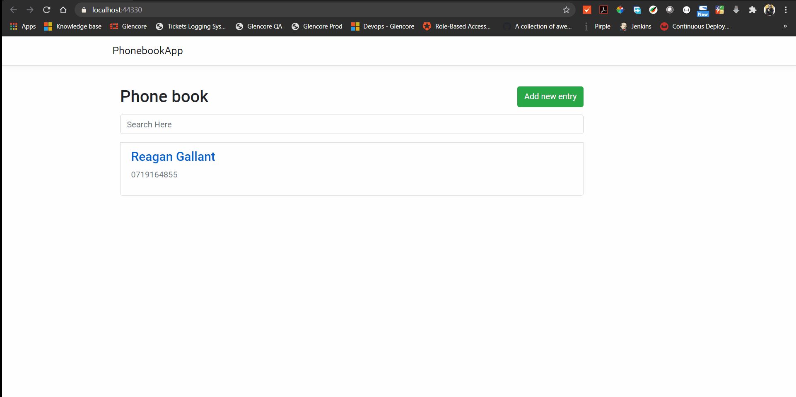
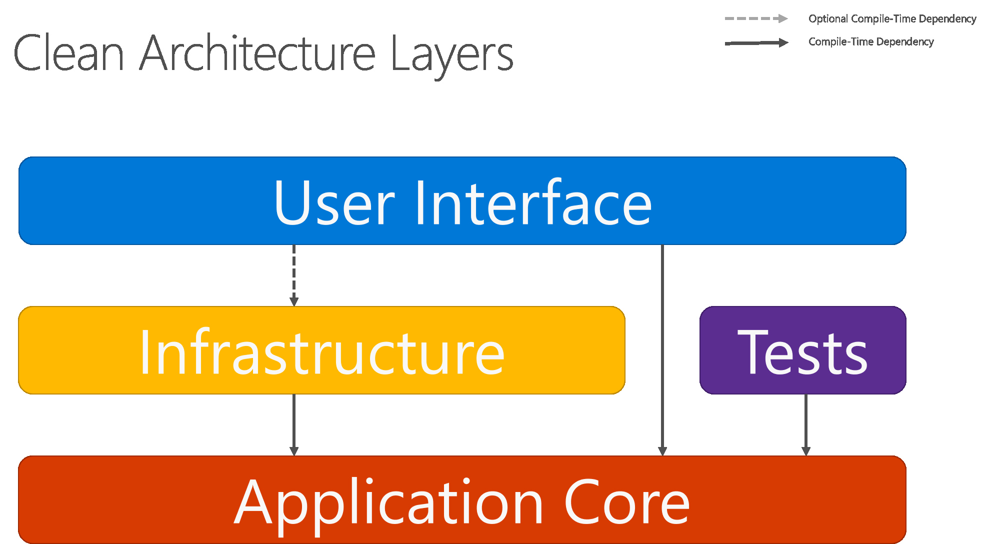
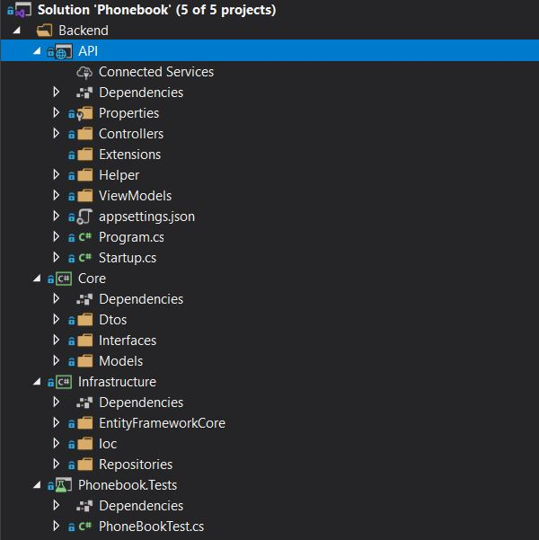
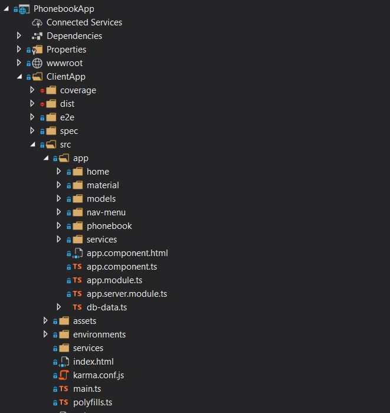
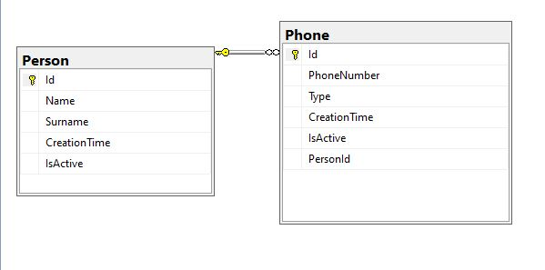

# Phone book App

**Task:**

Create a simple phone book application using the technologies & patterns that you feel best show your technical knowledge. 
What we are looking for is any type of front end that can post a payload to an API and make its way to a database.

**Use Cases:**

Add entry to my phone book
View phonebook where I can search for entries(text box to search and list view)

**Data Structures:**

**PhoneBook** {Name,Entries}
**Entry** {Phone,PhoneNumber}

### Technologies

* [.NET Core 3.1](https://dotnet.microsoft.com/download)
* [ASP.NET Core 3.1](https://docs.microsoft.com/en-us/aspnet/core)
* [Entity Framework Core 3.1](https://docs.microsoft.com/en-us/ef/core)
* [C# 8.0](https://docs.microsoft.com/en-us/dotnet/csharp)
* [Angular 10](https://angular.io/docs)
* SQL Server 

## Demo

## Practices

* Clean Code
* SOLID Principles
* DDD (Domain-Driven Design)
* Separation of Concerns
* DevOps
* Code Analysis

#### Prerequisites

* [.NET Core SDK](https://aka.ms/dotnet-download)
* [SQL Server](https://go.microsoft.com/fwlink/?linkid=866662)
* [Node.js](https://nodejs.org)
* [Angular CLI](https://cli.angular.io)

## Layers

**API:**             Dotnet core 3.1 API

**Core:**            Business rules and domain logic.

**Infrastructure:**  Data access implementationss.

**Phonebook.Test:**  Unit tests

**PhonebookApp**     Frontend (Angular 10)

#Project Structure

## Some other tool and libraries used:

* EntityFrameworkCore
* Automapper
* xunit
* Moq
* DevOps
* Jasmin
* Angular Material
* Angular Bootstrap
* Dependency Injection
* Repository Pattern
* Cors
* Typescript
* RXJS

